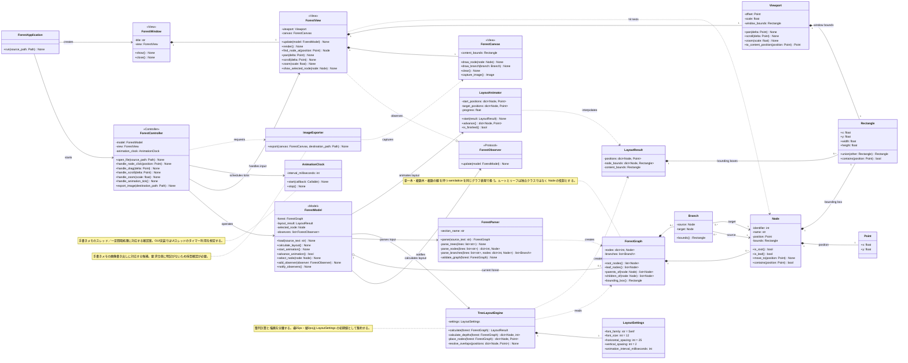

# 設計(仮)

```mermaid
classDiagram
direction LR

class ForestApplication {
  +run(source_path: Path) None
}

class ForestController {
  <<Controller>>
  -model: ForestModel
  -view: ForestView
  -animation_clock: AnimationClock
  +open_file(source_path: Path) None
  +handle_node_click(position: Point) None
  +handle_drag(delta: Point) None
  +handle_scroll(delta: Point) None
  +handle_zoom(scale: float) None
  +handle_animation_tick() None
  +export_image(destination_path: Path) None
}

class ForestModel {
  <<Model>>
  -forest: ForestGraph
  -layout_result: LayoutResult
  -selected_node: Node
  -observers: list~ForestObserver~
  +load(source_text: str) None
  +calculate_layout() None
  +start_animation() None
  +advance_animation() bool
  +select_node(node: Node) None
  +add_observer(observer: ForestObserver) None
  +notify_observers() None
}

class ForestObserver {
  <<Protocol>>
  +update(model: ForestModel) None
}

class ForestView {
  <<View>>
  -viewport: Viewport
  -canvas: ForestCanvas
  +update(model: ForestModel) None
  +render() None
  +find_node_at(position: Point) Node
  +pan(delta: Point) None
  +scroll(delta: Point) None
  +zoom(scale: float) None
  +show_selected_node(node: Node) None
}

class ForestWindow {
  <<View>>
  -title: str
  -view: ForestView
  +show() None
  +close() None
}

class ForestCanvas {
  <<View>>
  -content_bounds: Rectangle
  +draw_node(node: Node) None
  +draw_branch(branch: Branch) None
  +clear() None
  +capture_image() Image
}

class Viewport {
  -offset: Point
  -scale: float
  -window_bounds: Rectangle
  +pan(delta: Point) None
  +scroll(delta: Point) None
  +zoom(scale: float) None
  +to_content_position(position: Point) Point
}

class ForestParser {
  -section_name: str
  +parse(source_text: str) ForestGraph
  -parse_trees(lines: list~str~) None
  -parse_nodes(lines: list~str~) dict~int, Node~
  -parse_branches(lines: list~str~, nodes: dict~int, Node~) list~Branch~
  -validate_graph(forest: ForestGraph) None
}

class ForestGraph {
  -nodes: dict~int, Node~
  -branches: list~Branch~
  +root_nodes() list~Node~
  +leaf_nodes() list~Node~
  +parents_of(node: Node) list~Node~
  +children_of(node: Node) list~Node~
  +bounding_box() Rectangle
}

class Node {
  -identifier: int
  -name: str
  -position: Point
  -bounds: Rectangle
  +is_root() bool
  +is_leaf() bool
  +move_to(position: Point) None
  +contains(position: Point) bool
}

class Branch {
  -source: Node
  -target: Node
  +bounds() Rectangle
}

class TreeLayoutEngine {
  -settings: LayoutSettings
  +calculate(forest: ForestGraph) LayoutResult
  -calculate_depths(forest: ForestGraph) dict~Node, int~
  -place_nodes(forest: ForestGraph) dict~Node, Point~
  -resolve_overlaps(positions: dict~Node, Point~) None
}

class LayoutSettings {
  +font_family: str = Serif
  +font_size: int = 12
  +horizontal_spacing: int = 25
  +vertical_spacing: int = 2
  +animation_interval_milliseconds: int
}

class LayoutResult {
  -positions: dict~Node, Point~
  -node_bounds: dict~Node, Rectangle~
  -content_bounds: Rectangle
}

class LayoutAnimator {
  -start_positions: dict~Node, Point~
  -target_positions: dict~Node, Point~
  -progress: float
  +start(result: LayoutResult) None
  +advance() dict~Node, Point~
  +is_finished() bool
}

class AnimationClock {
  -interval_milliseconds: int
  +start(callback: Callable) None
  +stop() None
}

class ImageExporter {
  +export(canvas: ForestCanvas, destination_path: Path) None
}

class Point {
  +x: float
  +y: float
}

class Rectangle {
  +x: float
  +y: float
  +width: float
  +height: float
  +union(other: Rectangle) Rectangle
  +contains(position: Point) bool
}

ForestApplication --> ForestController : starts
ForestApplication --> ForestWindow : creates
ForestController --> ForestModel : operates
ForestController --> ForestView : handles input
ForestController --> AnimationClock : schedules ticks
ForestController ..> ImageExporter : requests

ForestView ..|> ForestObserver : observes
ForestModel --> ForestObserver : notifies
ForestModel "1" o-- "0..1" ForestGraph : current forest
ForestModel --> ForestParser : parses input
ForestModel --> TreeLayoutEngine : calculates layout
ForestModel --> LayoutAnimator : animates layout

ForestWindow "1" *-- "1" ForestView
ForestView "1" *-- "1" ForestCanvas
ForestView "1" *-- "1" Viewport
ForestView ..> Node : hit tests

ForestGraph "1" *-- "0..*" Node
ForestGraph "1" *-- "0..*" Branch
Branch "0..*" --> "1" Node : source
Branch "0..*" --> "1" Node : target
ForestParser ..> ForestGraph : creates

TreeLayoutEngine "1" *-- "1" LayoutSettings
TreeLayoutEngine ..> ForestGraph : reads
TreeLayoutEngine ..> LayoutResult : creates
LayoutResult "1" *-- "0..*" Rectangle : bounding boxes
LayoutAnimator ..> LayoutResult : interpolates
Node "1" *-- "1" Point : position
Node "1" *-- "1" Rectangle : bounding box
Viewport "1" *-- "1" Rectangle : window bounds
ImageExporter ..> ForestCanvas : captures


note for ForestGraph "単一木・複数木・複数の親を持つ semilattice を同じグラフ表現で扱う。ルートとリーフは独立クラスではなく Node の役割とする。"
note for TreeLayoutEngine "整列計算と描画を分離する。横25px・縦2pxは LayoutSettings の初期値として集約する。"
note for AnimationClock "手書きメモのスレッド／一定間隔処理に対応する確認案。GUI実装ではUIスレッドのタイマー利用を想定する。"
note for ImageExporter "手書きメモの画像書き出しに対応する候補。要求仕様に明記がないため採否確認が必要。"
```
